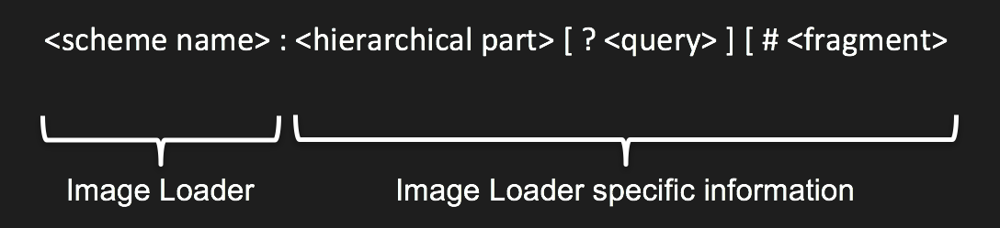

# Image Ids

> A Cornerstone **Image Id** is a URL which identifies a single image for cornerstone to display.

The URL scheme in the Image Id is used by Cornerstone to determine which [Image Loader](image-loaders.md) plugin to call to actually load the image. This strategy allows Cornerstone to simultaneously display multiple images obtained with different protocols from different servers. For example, Cornerstone could display a DICOM CT image obtained via [WADO](https://en.wikipedia.org/wiki/DICOMweb) alongside a JPEG dermatology image captured by a digital camera and stored on a file system.

#### The Image Id format

Cornerstone does not specify what the contents of the URL are - it is up to the [Image Loader](image-loaders.md) to define the contents and format of the URL so that it can locate the image. For example, a proprietary [Image Loader](image-loaders.md) plugin could be written to talk to a proprietary server and lookup images using a GUID, filename or database row id.

Here are some examples of what an Image Id could look like for different [Image Loader](image-loaders.md) plugins:

* example://1
* dicomweb://server/wado/{uid}/{uid}/{uid}
* http://server/image.jpeg
* custom://server/uuid
