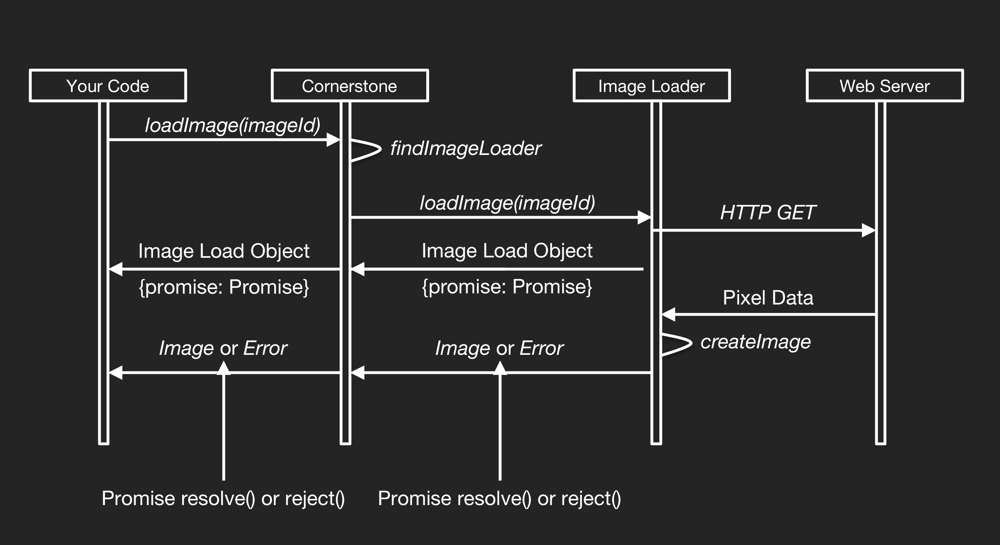

# Image Loaders

> An **Image Loader** is a JavaScript function that is responsible for taking an [Image Id](image-ids.md) for an Image and returning the corresponding **Image Load Object** for that Image to Cornerstone. The **Image Load Object** contains a Promise which resolves to produce an **Image**.

Since loading images usually requires a call to a server, the API for image loading needs to be asynchronous. Cornerstone requires that Image Loaders return an Object containing a [Promise](https://developer.mozilla.org/en-US/docs/Web/JavaScript/Reference/Global_Objects/Promise) which Cornerstone will use to receive the Image Object asynchronously, or an [Error](https://developer.mozilla.org/en-US/docs/Web/JavaScript/Reference/Global_Objects/Error) if one has occurred.

## Image Loader Workflow



1. ImageLoaders register themselves with cornerstone to load specific [ImageId](../image-ids.md) URL schemes
2. The application requests to load an image using the loadImage() api.
3. Cornerstone delegates the request to load the image to the ImageLoader registered with the URL scheme of the imageId passed to loadImage().
4. The ImageLoader will return an Image Load Object containing a Promise which it will resolve with the corresponding [Image Object](./images.md) once it has obtained the pixel data. Obtaining the pixel data may may require a call to a remote server using XMLHttpRequest, decompression of the pixel data (e.g. from JPEG 2000), and conversion of the pixel data into the format that Cornerstone understands (e.g. RGB vs YBR color).
5. The [Image Object](./images.md) passed back by the resolved Promise is then displayed using the `displayImage()` API.

While pixel data is usually obtained from a server, this doesn't always have to be the case. The live examples actually use an ImageLoader plugin to serve up images without requiring a server at all.  In this case, the images are base64 encoded and stored in the ImageLoader plugin itself. The plugin simply converts the base64 pixel data into an array of pixels. Alternatively, one could write an image loader that generates derived images on the client side. For example, you could implement MPR functionality this way.

## Available Image Loaders
Image Loader | Used for
-------------| --------------
[Cornerstone WADO Image Loader](https://github.com/cornerstonejs/cornerstoneWADOImageLoader) | DICOM Part 10 images<br> Supports WADO-URI and WADO-RS<br> Supports multi-frame DICOM instances<br> Supports reading DICOM files from the File objects
[Cornerstone Web Image Loader](https://github.com/cornerstonejs/cornerstoneWebImageLoader) | PNG and JPEG images

*Feel free to send a Pull Request if you have an Image Loader you want to add to this list.*

## Image Load Object

Cornerstone Image Loaders return **Image Load Objects** which contain a Promise. The reason we have chosen to use an Object instead of solely returning a Promise is because now Image Loaders can also return other properties in their Image Load Objects. As an example, we intend to implement support for cancelling pending or ongoing requests using a **cancelFn** passed back by an Image Loader within an Image Load Object. This is still in development, however.

## Writing an Image Loader
Here is an example of an Image Loader that fetches pixel data using XMLHttpRequest and return an **Image Load Object** containing a Promise to Cornerstone:

````javascript
function loadImage(imageId) {
    // Parse the imageId and return a usable URL (logic omitted)
    const url = parseImageId(imageId);

    // Create a new Promise
    const promise = new Promise((resolve, reject) => {
      // Inside the Promise Constructor, make
      // the request for the DICOM data
      const oReq = new XMLHttpRequest();
      oReq.open("get", url, true);
      oReq.responseType = "arraybuffer";
      oReq.onreadystatechange = function(oEvent) {
          if (oReq.readyState === 4) {
              if (oReq.status == 200) {
                  // Request succeeded, Create an image object (logic omitted)
                  const image = createImageObject(oReq.response);

                  // Return the image object by resolving the Promise
                  resolve(image);
              } else {
                  // An error occurred, return an object containing the error by
                  // rejecting the Promise
                  reject(new Error(oReq.statusText));
              }
          }
      };

      oReq.send();
    });

    // Return an object containing the Promise to cornerstone so it can setup callbacks to be
    // invoked asynchronously for the success/resolve and failure/reject scenarios.
    return {
      promise
    };
}
````

An Image Loader is responsible for returning an **Image Load Object** corresponding to the [Image Id](./image-ids.md) Cornerstone passed to its loadImage function. When the Promise in the Image Load Object is resolved, it should be resolved with an [Image](./images.md). Image Loaders register themselves for a given URL scheme using the `registerImageLoader()` API:

````javascript
// Register the url scheme 'myCustomLoader' to correspond to our loadImage function
cornerstone.registerImageLoader('myCustomLoader', loadImage);

// Images loaded as follows will be passed to our loadImage function:
cornerstone.loadImage('myCustomLoader://example.com/image.dcm')
````
