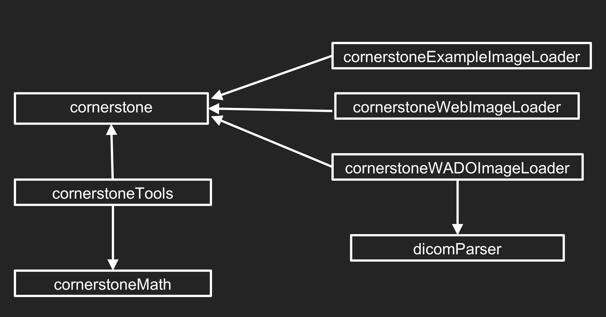

# Libraries

> Cornerstone is an open source project with a goal to deliver a complete web based medical imaging platform. It provides modular libraries which can be used either together or independently.

The central element of the Cornerstone ecosystem is the Cornerstone Core library, commonly referred to just as *Cornerstone*. This is the library that handles the [image rendering pipeline](./rendering-pipeline.md), [loading](./image-loaders.md), [caching](../advanced/image-cache.md), and [viewport transformations](./viewports.md).

Aside from the core library, there are several other libraries supported by the Cornerstone development team which provide the ecosystem for developing complex imaging applications.

Library                                                          | Description
-----------------------------------------------------------------|------------
[Cornerstone Core](https://github.com/cornerstonejs/cornerstone) | Central library providing image rendering, loading, caching, and viewport transformations
[Cornerstone Tools](https://github.com/cornerstonejs/cornerstoneTools) | Extensible support for building tools, support for mouse, keyboard, and touch devices.
[Cornerstone WADO Image Loader](https://github.com/cornerstonejs/cornerstoneWADOImageLoader) | Image Loader for DICOM Part 10 files
[Cornerstone Web Image Loader](https://github.com/cornerstonejs/cornerstoneWebImageLoader) | Image Loader for Web Image files (PNG, JPEG)
[Cornerstone Math](https://github.com/cornerstonejs/cornerstoneMath) | Mathematical utility functions and classes to support tool development
[dicomParser](https://github.com/cornerstonejs/dicomParser) | Robust DICOM Part 10 parsing library
