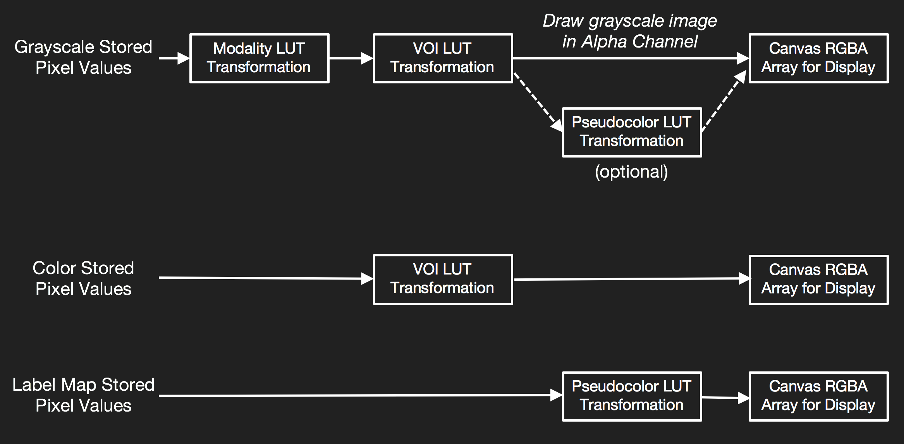

# Rendering Pipeline

> Cornerstone will select from multiple image rendering pipelines depending on the Image (e.g. grayscale, color, label map, viewport pseudocolor) type.

### Rendering Pipeline Workflow

Rendering path | Description
------------------------------------------------------- | -----------------------------
[renderGrayscaleImage](../api.md#rendergrayscaleimage)  | Default rendering pipeline for grayscale images. Includes Modality and VOI LUT transformations.
[renderPseudoColorImage](../api.md#renderpseudocolorimage) | Used when Viewport **colormap** property is set. This will apply the Pseudocolor LUT transformation to the pixel data following the Modality LUT and VOI LUT transformations.
[renderColorImage](../api.md#rendercolorimage) | Default rendering pipeline for color images. Alpha for all pixels are left opaque unless the **rgba** property of the Image is set to **true**.
[renderWebImage](../api.md#renderwebimage) | Custom rendering pipeline used for images (PNG, JPEG) which have been loaded by the browser. If no VOI LUT transformations (windowWidth, windowCenter, invert) have been applied, the canvas can be drawn directly from the Image **getImage** function.
[renderLabelMapImage](../api.md#renderlabelmapimage) | Rendering pipeline for label maps. The pseudocolor LUT transform is applied directly to the stored pixel data. No Modality or VOI LUT transformations are applied.
