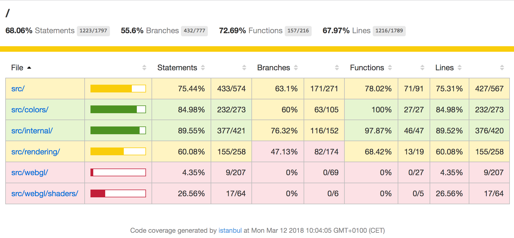

# Developer Guide
In order to edit and rebuild Cornerstone, you will need to install [Node.js](http://nodejs.org). Once you have Node.js and the npm package manager installed, you can use them to install the dependencies for the project and run common development tasks.

## Common Tasks
#### Installing dependencies
  ``` bash
  npm install
  ```
**Note**: Installing/updating dependencies should be performed after every update from the git repository. If this is not performed, you may run into issues during development.

#### Running the build
  ``` bash
  npm start
  ```
Running the build will create both the minified and un-minified versions of the library, as well as their associated source maps.

#### Automatically running the build after each source change
  ``` bash
  npm run watch
  ```
This command can be used if you want to debug issues or add new features to the source code.

#### Serving files for development
There are many ways of running simple HTTP servers. This is just one method, you can also use e.g. 'python -m simplehttpserver 8080'.
  1. Install the 'http-server' package:
    ``` bash
    npm install http-server -g
    ```
  **Note**: you may need to use sudo to install globally

  2. Run the server
    ``` bash
    http-server
    ```
  3. Navigate to http://127.0.0.1:8080/example/index.html to load the examples in a browser.

**Note:** If you want to use them on a mobile device, start the HTTP server and navigate to the IP of your computer (e.g. http://192.168.1.11:8080/example/index.html)

#### Running and debugging the tests
``` bash
npm test
```
When you run the tests a 'coverage' directory will be created. Note that this directory does not exist in the main repository, since it is solely a build artifact. If you open the HTML file under  'coverage/html/index.html' with a web browser (no HTTP server is required), you will be able to view and examine the test coverage report.



Once you have started the tests, you can also navigate to http://0.0.0.0:9876/debug within a web browser to debug the tests through the Karma test runner. Note that this URL does not work immediately, since the first step in ```npm test``` is to rebuild the library.

#### Running code linting
``` bash
npm run eslint

# Or include automatic fixing with:
npm run eslint-fix

# Or automatically fix 'test' directory with:
npm run eslint-fix-test
```

Running the commands above will check the source code for linting issues.

#### Submitting changes through Pull Requests
If you have made a source code change that you think should be included in the main repository, you can contribute it back to the community by creating a [Pull Request](https://github.com/cornerstonejs/cornerstone/pulls). Please create an associated [Issue](https://github.com/cornerstonejs/cornerstone/issues) to describe the problem you are solving / feature you are adding so the library maintainers can give you feedback on whether or not these changes are appropriate for the repository. It's possible that your bug fix / new feature would be better implemented in another library (e.g. [Cornerstone Tools](https://github.com/chafey/cornerstoneTools/)). Please ensure that all tests pass and you have run ESLint and fixed any issues before submitting a pull request.

## Development Toolchain and Specifications
Cornerstone relies on a number of open source tools, components, and free services to ensure quality and stability. We want to ensure developers can work in modern JavaScript and that end users can use the tools in both current and legacy environments.

#### General
* [Babel](https://babeljs.io/) for transpilation from next generation JavaScript to more widely supported previous JavaScript versions.
* [WebPack](https://webpack.js.org/) to bundle the project
* [ESLint](https://eslint.org/) is used to enforce code styling and maintain quality
* [NPM](https://www.npmjs.com/) is used to host the installable package. See [Cornerstone Core on NPM](https://www.npmjs.com/package/cornerstone-core)
* [Semantic Versioning](https://semver.org/) is used for versioning of the library.
* [keep a changelog](https://keepachangelog.com) is used for the formatting of the changelog.

#### Testing
* [Karma](https://karma-runner.github.io/) is used as a test runner
* [Mocha](https://mochajs.org/) is used as a test framework
* [Chai](https://chaijs.com) is used for test assertions
* [Istanbul](https://istanbul.js.org/) is used to report code coverage
* [Travis CI](https://travis-ci.org/) is used to automatically run tests. See [Cornerstone Core on Travis CI](https://travis-ci.org/cornerstonejs/cornerstone)
* [Coveralls](https://coveralls.io/) is used to display code coverage following automatic tests. See [Cornerstone Core Coveralls Test Coverage](https://coveralls.io/github/cornerstonejs/cornerstone?branch=master)
* [PhantomJS](http://phantomjs.org/) is used for running headless tests.

#### Documentation
* [JSDoc](https://usejsdoc.org) formatting is used for documenting the source code.
* [documentation.js](https://documentation.js.org/) generates API documentation in Markdown from JSDoc annotations
* [GitBook](https://www.gitbook.com) transforms the Markdown documentation into HTML
* [Github Pages](https://pages.github.com/) hosts the documentation
* [Cloudflare](https://www.cloudflare.com/) is placed in front of Github Pages to serve the documentation over HTTPS.
* [Rawgit](https://rawgit.com/) is used to serve [Live Examples](https://rawgit.com/cornerstonejs/cornerstone/master/example/index.html) from the repository. We should transition this to be hosted with Github Pages as well.

## Writing tests
Here are some general notes on writing tests which may be useful:
* Tests must be in the 'test' directory. Please try to ensure they follow the 'src' directory layout for simplicity.
* Test file names must end in "\_test.js"
* The 'coverage_test.js' file ensures that all files are considered by Istanbul, so that code coverage reports can be used to explore the whole repository.
* Do not convert 'function ()' to arrow functions (i.e. '=> {}') within the 'it', 'should', or 'describe' blocks or Mocha will fail to run the tests properly.
* Some polyfills are currently required to run all of the tests with PhantomJS, since certain features are not supported (e.g. Promises). This issue may be resolved by switching from PhantomJS to headless version of browsers themselves.


## Releasing a new version
1. Make sure you have the latest commits from master
2. Determine the version change you need to make based on the scope of the changes since the last release.
3. Update the [changelog](https://github.com/cornerstonejs/cornerstone/blob/master/changelog.md)
  * Make sure to thank any code contributors!
3. Update the package and dependency versions in "package.json"
4. Update the build version:
  ``` bash
  npm run version
  ```
5. Run the build:
  ``` bash
  npm run build
  ```
5. Tag and push the commit with the version number to master
  ``` bash
  git push origin master --tags
  ```
6. Publish the release to NPM:
  ``` bash
  npm publish
  ```
